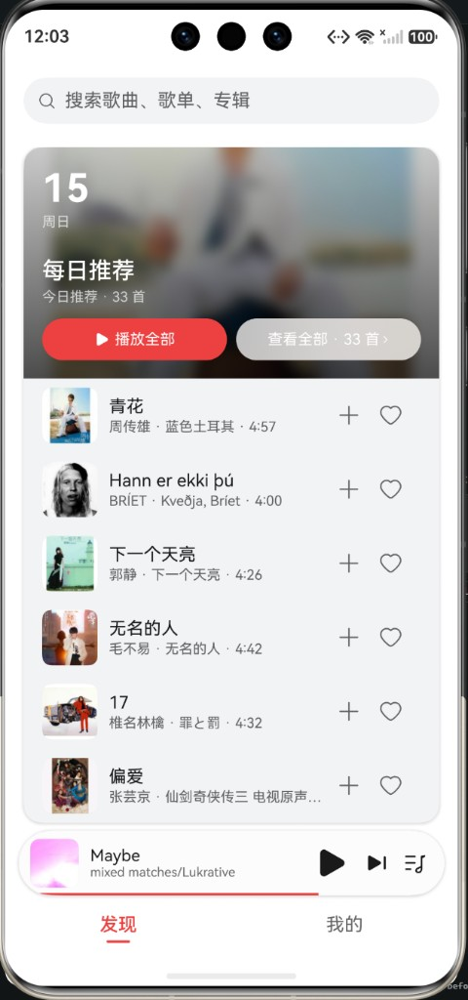

# NCM

HarmonyOS 第三方网易云音乐客户端，用 ArkTS + ArkUI（Stage 模型）实现。

<p align="center">
  
</p>

## 功能

- 发现：顶栏搜索、每日推荐入口卡与预览歌曲
- 日推：完整每日推荐列表
- 我的：登录后查看自建 / 收藏歌单
- 歌单、专辑详情
- 扫码或账号登录
- 播放器：封面沉浸背景、歌词滚动、循环模式、迷你播放条、播放队列、后台播放
- 设置：浅色 / 深色 / 跟随系统、字号、字体

## 环境

- 设备：手机
- SDK：HarmonyOS 6.1.1（API 24）
- 包名：`sanstoolow.netesohm.huawei`

## 构建

用 [DevEco Studio](https://developer.huawei.com/consumer/cn/deveco-studio/) 打开本仓库，配置自动签名后连接真机或模拟器（API 24+）运行。

命令行（需本机已配置 DevEco 的 ohpm / hvigor）：

```bash
ohpm install
hvigorw assembleHap --mode module -p product=default
```

## 说明

本项目为非官方客户端，仅供学习交流。网易云音乐相关接口与内容版权归网易所有。
